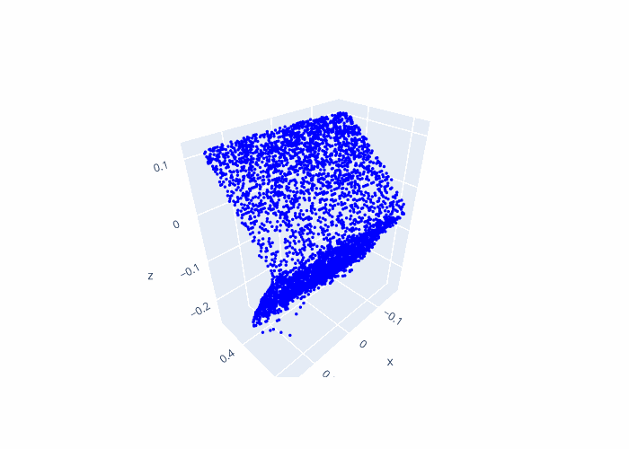
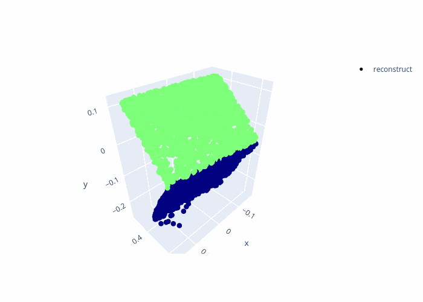

<p align="center">
  <h1 align="center">4D Articulation Modeling from Monocular Video</h1>
</p>


## Installation
- Reart: follow `reart/README.md` to install conda env and download pretrained models under `reart/pretrained/corr_model.pth.tar`


## Data
- Laptop: put hongchi data under current directory `laptop2`

## Run

###  Reart
```bash
conda activate reart
cd reart/
python  run_real.py --seq_dir ../laptop2 --id_list 0, 24, 34, 49, 65, 85 --save_root=exp --cano_idx=0 --use_flow_loss --use_nproc --use_assign_loss --assign_iter=1000
```

## Reart results
Input| Recon
---|---
 | 